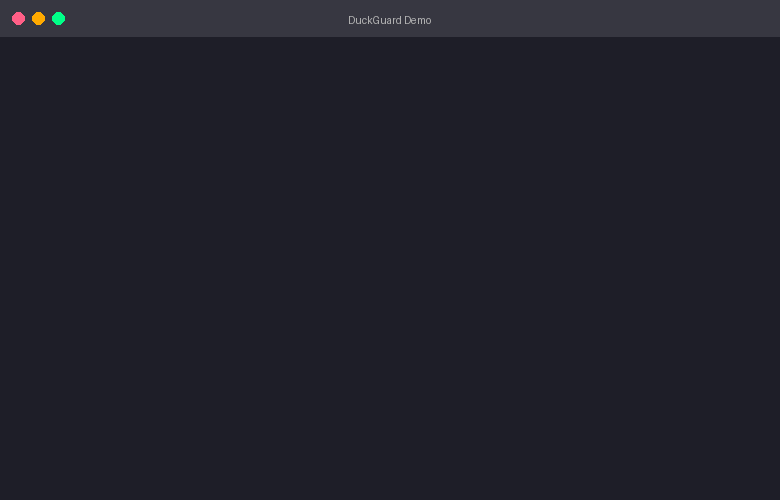

<div align="center">
  

  <h3>Data Quality That Just Works</h3>
  <p><strong>Python-native</strong> &bull; <strong>DuckDB-powered</strong> &bull; <strong>10x faster</strong></p>

  [](https://pypi.org/project/duckguard/)
  [](https://pepy.tech/project/duckguard)
  [](https://github.com/XDataHubAI/duckguard/stargazers)
  [](https://www.python.org/downloads/)
  [](https://www.elastic.co/licensing/elastic-license)
  [](https://github.com/XDataHubAI/duckguard/actions/workflows/ci.yml)

  [](https://colab.research.google.com/github/XDataHubAI/duckguard/blob/main/examples/getting_started.ipynb)
  [](https://kaggle.com/kernels/welcome?src=https://github.com/XDataHubAI/duckguard/blob/main/examples/getting_started.ipynb)
</div>

---

## Installation

```bash
pip install duckguard

# With optional features
pip install duckguard[reports]   # HTML/PDF reports
pip install duckguard[airflow]   # Airflow integration
pip install duckguard[all]       # All features
```

## Why DuckGuard?

<table>
<tr>
<td width="50%">

**Great Expectations / Pandas**
```python
# 50+ lines of boilerplate
context = get_context()
datasource = context.sources.add_pandas(...)
asset = datasource.add_dataframe_asset(...)
batch = asset.build_batch_request()
validator = context.get_validator(...)
validator.expect_column_values_to_not_be_null("id")
# ... more setup
```
**45 seconds, 4GB RAM for 1GB CSV**

</td>
<td width="50%">

**DuckGuard**
```python
from duckguard import connect

orders = connect("orders.csv")
assert orders.id.null_percent == 0
```
**4 seconds, 200MB RAM for 1GB CSV**

</td>
</tr>
</table>

## Demo

<div align="center">
  
</div>

```python
# Python API - feels like pytest
from duckguard import connect

orders = connect("data/orders.csv")

assert orders.row_count > 0
assert orders.customer_id.null_percent < 5
assert orders.amount.between(0, 10000)
assert orders.status.isin(['pending', 'shipped', 'delivered'])
```

---

## Features

<table>
<tr>
<td align="center" width="25%">
<br>
<b>Quality Scoring</b><br>
<sub>A-F grades based on ISO 8000</sub>
</td>
<td align="center" width="25%">
<br>
<b>PII Detection</b><br>
<sub>Auto-detect emails, SSNs, phones</sub>
</td>
<td align="center" width="25%">
<br>
<b>Anomaly Detection</b><br>
<sub>Z-score, IQR, ML baselines</sub>
</td>
<td align="center" width="25%">
<br>
<b>Alerts</b><br>
<sub>Slack, Teams, Email notifications</sub>
</td>
</tr>
<tr>
<td align="center">
<br>
<b>Freshness Monitoring</b><br>
<sub>Detect stale data automatically</sub>
</td>
<td align="center">
<br>
<b>Schema Evolution</b><br>
<sub>Track & detect breaking changes</sub>
</td>
<td align="center">
<br>
<b>Data Contracts</b><br>
<sub>Schema + SLAs enforcement</sub>
</td>
<td align="center">
<br>
<b>Row-Level Errors</b><br>
<sub>See exactly which rows failed</sub>
</td>
</tr>
<tr>
<td align="center">
<br>
<b>HTML/PDF Reports</b><br>
<sub>Beautiful shareable reports</sub>
</td>
<td align="center">
<br>
<b>Historical Tracking</b><br>
<sub>Quality trends over time</sub>
</td>
<td align="center">
<br>
<b>dbt Integration</b><br>
<sub>Export rules as dbt tests</sub>
</td>
<td align="center">
<br>
<b>CI/CD Ready</b><br>
<sub>GitHub Actions & Airflow</sub>
</td>
</tr>
</table>

---

## Connect to Anything

**Files:** CSV, Parquet, JSON, Excel
**Cloud:** S3, GCS, Azure Blob
**Databases:** PostgreSQL, MySQL, SQLite, Snowflake, BigQuery, Redshift, Databricks, SQL Server, Oracle, MongoDB
**Streaming:** Kafka
**Formats:** Delta Lake, Apache Iceberg

```python
# Connect to anything
orders = connect("s3://bucket/orders.parquet")
orders = connect("postgres://localhost/db", table="orders")
orders = connect("snowflake://account/db", table="orders")
orders = connect("databricks://workspace/catalog/schema", table="orders")
orders = connect("kafka://broker:9092/orders-topic", sample_size=1000)
```

---

## Quick Examples

<details open>
<summary><b>Quality Score</b></summary>

```python
quality = orders.score()
print(f"Grade: {quality.grade}")  # A, B, C, D, or F
print(f"Score: {quality.score}/100")
```
</details>

<details>
<summary><b>YAML Rules</b></summary>

```yaml
# duckguard.yaml
dataset: orders
rules:
  - order_id is not null
  - order_id is unique
  - amount >= 0
  - status in ['pending', 'shipped', 'delivered']
```

```python
from duckguard import load_rules, execute_rules
result = execute_rules(load_rules("duckguard.yaml"), dataset=orders)
```
</details>

<details>
<summary><b>PII Detection</b></summary>

```python
from duckguard.semantic import SemanticAnalyzer
analysis = SemanticAnalyzer().analyze(orders)
print(f"PII found: {analysis.pii_columns}")
# PII found: ['email', 'phone', 'ssn']
```
</details>

<details>
<summary><b>Anomaly Detection</b></summary>

```python
from duckguard import detect_anomalies

# Basic statistical methods
report = detect_anomalies(orders, method="zscore")
report = detect_anomalies(orders, method="iqr")

# ML-based: Learn baseline from current data
report = detect_anomalies(orders, method="baseline", learn_baseline=True)

# Later: compare new data against stored baseline
report = detect_anomalies(new_orders, method="baseline")
if report.has_anomalies:
    print(f"Found {len(report.anomalies)} anomalies!")

# Detect distribution drift using Kolmogorov-Smirnov test
report = detect_anomalies(orders, method="ks_test")

# Seasonal anomaly detection
report = detect_anomalies(orders, method="seasonal", period="daily")
```
</details>

<details>
<summary><b>Freshness Monitoring</b></summary>

```python
from duckguard import connect
from duckguard.freshness import FreshnessMonitor
from datetime import timedelta

data = connect("data.csv")

# Quick freshness check via property
print(data.freshness.age_human)  # "2 hours ago"
print(data.freshness.is_fresh)   # True (default 24h threshold)

# Check with custom threshold
if not data.is_fresh(timedelta(hours=6)):
    print("Data is stale!")

# Column-based freshness (for databases/warehouses)
monitor = FreshnessMonitor(threshold=timedelta(hours=1))
result = monitor.check_column_timestamp(data, "updated_at")
print(f"Last update: {result.age_human}, Fresh: {result.is_fresh}")
```
</details>

<details>
<summary><b>Schema Evolution Tracking</b></summary>

```python
from duckguard import connect
from duckguard.schema_history import SchemaTracker, SchemaChangeAnalyzer

data = connect("data.csv")

# Capture schema snapshot
tracker = SchemaTracker()
snapshot = tracker.capture(data)
print(f"Captured: {snapshot.column_count} columns, {snapshot.row_count} rows")

# Later: detect schema changes
analyzer = SchemaChangeAnalyzer()
report = analyzer.detect_changes(data)

if report.has_breaking_changes:
    print("Breaking schema changes detected!")
    for change in report.breaking_changes:
        print(f"  {change}")

# View schema history
history = tracker.get_history("data.csv", limit=10)
for snap in history:
    print(f"{snap.captured_at}: {snap.column_count} columns")
```
</details>

<details>
<summary><b>Email Notifications</b></summary>

```python
from duckguard import execute_rules, load_rules
from duckguard.notifications import EmailNotifier

email = EmailNotifier(
    smtp_host="smtp.gmail.com",
    smtp_port=587,
    smtp_user="alerts@company.com",
    smtp_password="app_password",
    to_addresses=["team@company.com", "oncall@company.com"],
)
# Or set DUCKGUARD_EMAIL_CONFIG env var with JSON config

result = execute_rules(load_rules("duckguard.yaml"), dataset=orders)
if not result.passed:
    email.send_failure_alert(result)
```
</details>

<details>
<summary><b>Slack/Teams Notifications</b></summary>

```python
from duckguard.notifications import SlackNotifier

slack = SlackNotifier(webhook_url="https://hooks.slack.com/...")
# Or set DUCKGUARD_SLACK_WEBHOOK env var

result = execute_rules(rules, dataset=orders)
if not result.passed:
    slack.send_failure_alert(result)
```
</details>

<details>
<summary><b>Data Contracts</b></summary>

```python
from duckguard import generate_contract, validate_contract

# Generate contract from existing data
contract = generate_contract(orders)

# Validate new data against contract
result = validate_contract(contract, new_orders)
if not result.passed:
    print("Contract violation!")
```
</details>

<details>
<summary><b>Row-Level Error Debugging</b></summary>

```python
# See exactly which rows failed validation
result = orders.quantity.between(1, 100)
if not result.passed:
    print(result.summary())
    # Sample of 10 failing rows (total: 25):
    #   Row 5: quantity=150 - Value 150 is outside range [1, 100]
    #   Row 12: quantity=200 - Value 200 is outside range [1, 100]

    # Get failed values as list
    print(result.get_failed_values())  # [150, 200, ...]
```
</details>

<details>
<summary><b>HTML/PDF Reports</b></summary>

```python
from duckguard import execute_rules, load_rules
from duckguard.reports import generate_html_report, generate_pdf_report

result = execute_rules(load_rules("duckguard.yaml"), dataset=orders)

# Generate beautiful HTML report
generate_html_report(result, "report.html", title="Orders Quality Report")

# Generate PDF report (requires weasyprint)
generate_pdf_report(result, "report.pdf")
```
</details>

<details>
<summary><b>Historical Tracking</b></summary>

```python
from duckguard.history import HistoryStorage, TrendAnalyzer

# Store validation results
storage = HistoryStorage()  # Uses ~/.duckguard/history.db
run_id = storage.store(result)

# Query historical runs
runs = storage.get_runs("orders.csv", limit=10)

# Analyze quality trends
analyzer = TrendAnalyzer(storage)
trend = analyzer.analyze("orders.csv", days=30)
print(f"Trend: {trend.score_trend}, Pass rate: {trend.pass_rate}%")
```
</details>

<details>
<summary><b>dbt Integration</b></summary>

```python
from duckguard import load_rules
from duckguard.integrations import dbt

# Export DuckGuard rules to dbt schema.yml
rules = load_rules("duckguard.yaml")
dbt.export_to_schema(rules, "models/schema.yml")

# Generate dbt singular tests
dbt.generate_singular_tests(rules, "tests/")

# Import dbt tests as DuckGuard rules
rules = dbt.import_from_dbt("models/schema.yml")
```
</details>

<details>
<summary><b>Airflow Integration</b></summary>

```python
from duckguard.integrations.airflow import DuckGuardOperator

# Use in your Airflow DAG
validate_orders = DuckGuardOperator(
    task_id="validate_orders",
    source="s3://bucket/orders.parquet",
    config="duckguard.yaml",
    fail_on_error=True,
    store_history=True,
)
```
</details>

<details>
<summary><b>GitHub Action</b></summary>

```yaml
# .github/workflows/data-quality.yml
- uses: XDataHubAI/duckguard/.github/actions/duckguard-check@main
  with:
    source: data/orders.csv
    config: duckguard.yaml
    fail-on-warning: false
```
</details>

---

## CLI Reference

```bash
# Core commands
duckguard check <file>           # Run quality checks
duckguard discover <file>        # Auto-generate rules
duckguard report <file>          # Generate HTML/PDF report
duckguard info <file>            # Show dataset info

# Anomaly detection
duckguard anomaly <file>                    # Detect anomalies (z-score)
duckguard anomaly <file> --method iqr       # Use IQR method
duckguard anomaly <file> --learn-baseline   # Learn ML baseline
duckguard anomaly <file> --method baseline  # Compare to baseline
duckguard anomaly <file> --method ks_test   # Distribution drift

# Freshness monitoring
duckguard freshness <file>                      # Check via file mtime
duckguard freshness <file> --column updated_at  # Check via column
duckguard freshness <file> --max-age 6h         # Custom threshold

# Schema evolution
duckguard schema <file> --action show      # Show current schema
duckguard schema <file> --action capture   # Capture snapshot
duckguard schema <file> --action history   # View schema history
duckguard schema <file> --action changes   # Detect changes

# Data contracts
duckguard contract generate <file>    # Create data contract
duckguard contract validate <file>    # Validate against contract

# History & trends
duckguard history                 # View validation history
duckguard history --trend         # Analyze quality trends
```

## Column Methods

```python
# Statistics
col.null_percent      # Percentage of null values
col.unique_percent    # Percentage of unique values
col.min, col.max      # Min/max values
col.mean, col.stddev  # Mean and standard deviation

# Validations (return ValidationResult)
col.between(0, 100)           # Range check
col.matches(r'^\d{5}$')       # Regex pattern
col.isin(['a', 'b', 'c'])     # Allowed values
col.has_no_duplicates()       # Uniqueness
col.greater_than(0)           # Comparison
col.not_null()                # Null check
```

## Performance

Built on DuckDB for blazing fast validation:

| Dataset | Pandas + Great Expectations | DuckGuard | Speedup |
|---------|----------------------------|-----------|---------|
| 1GB CSV | 45 seconds, 4GB RAM | 4 seconds, 200MB RAM | **10x** |
| 10GB Parquet | 8 minutes, 32GB RAM | 45 seconds, 2GB RAM | **10x** |

## Big Data Strategy

| Data Size | Recommendation |
|-----------|----------------|
| < 10M rows | DuckGuard directly |
| 10-100M rows | DuckGuard with Parquet, configure `memory_limit` |
| 100GB+ | Use database connectors (Snowflake, BigQuery, Databricks) |
| Delta Tables | Use Databricks connector for query pushdown |

```python
from duckguard import DuckGuardEngine, connect

# Configure for large datasets
engine = DuckGuardEngine(memory_limit="8GB")
dataset = connect("large_data.parquet", engine=engine)
```

## Contributing

We welcome contributions! See [CONTRIBUTING.md](CONTRIBUTING.md) for guidelines.

## License

Elastic License 2.0 - see [LICENSE](LICENSE)
